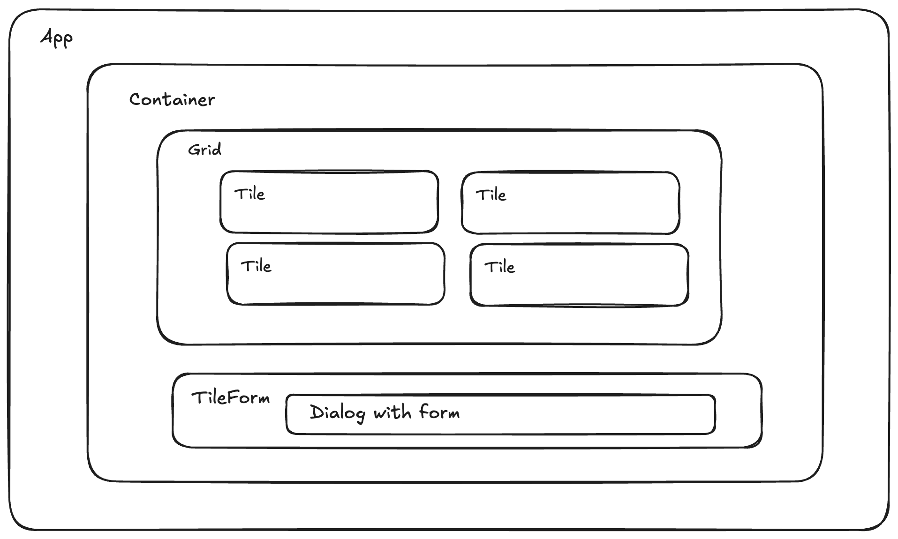

# Drag and Drop Tiles

Bootstrapped using Vite Reat-ts template

## Libraries Used

React, Tailwind CSS, Hero Icons HTML5 Drag and Drop events, Native Dialog element

## Components

### [Container.tsx](https://github.com/abbasmeeran/dndtiles/blob/main/src/Components/Container/index.tsx)

    The parent Container component fetch and updates the tiles data

### [Grid.tsx](https://github.com/abbasmeeran/dndtiles/blob/main/src/Components/Grid/index.tsx)

    Grid with dynamic rows and cols to display the tiles

### [Tile.tsx](https://github.com/abbasmeeran/dndtiles/blob/main/src/Components/Tile/index.tsx)

    Tile displays the messagew with with Drag and drop support

### [TileForm.tsx](https://github.com/abbasmeeran/dndtiles/blob/main/src/Components/TileForm/index.tsx)

    A Dialog has a form with onputs for messag e and date to add new tile

### [Messages.js](https://github.com/abbasmeeran/dndtiles/blob/main/src/Components/message.ts)

    Types and APIs to manage the messages
